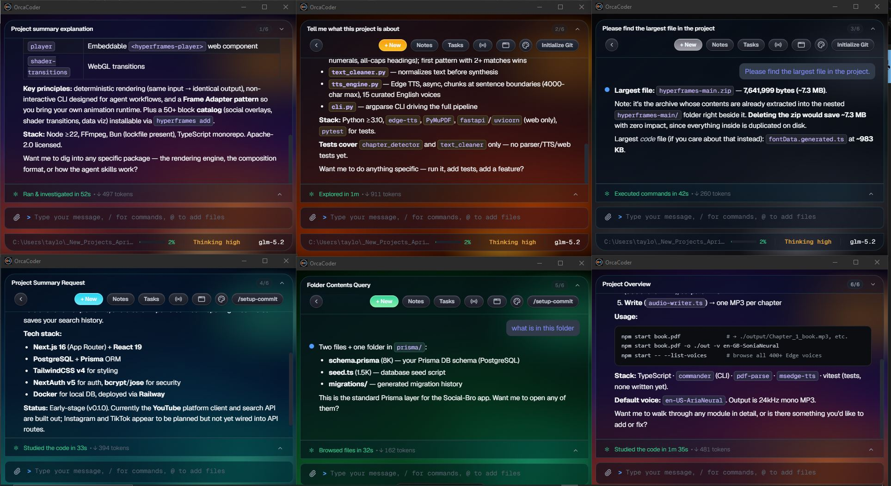
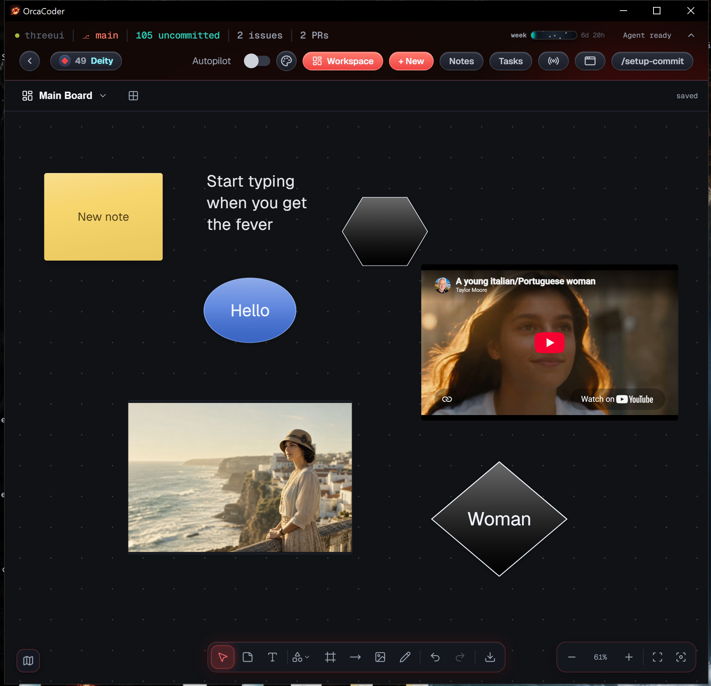

# OrcaCoder V3

<p align="center">
  
</p>

<p align="center">
  <strong>Creative development, engineered end to end.</strong>
</p>

<p align="center">
  
</p>

OrcaCoder V3 is a self-contained, Windows-first AI creative-development workstation built
from the MIT-licensed [GG Framework](https://github.com/KenKaiii/gg-framework). It preserves
the upstream coding workflow while adding the Scarlet Orca identity, public **Orca / @Orca**
mentor, appearance controls, ocean-themed motion, and a base for OrcaVoice, media inspection,
ComfyUI, and Houdini workflows.

## Current status — 30 September 2026

| Area                 | Status                                                                                       |
| -------------------- | -------------------------------------------------------------------------------------------- |
| Repository           | [`24pfilms/orccoderv3`](https://github.com/24pfilms/orccoderv3) — private during development |
| Application version  | `0.57.6`                                                                                      |
| Windows & restore    | Relaunch reopens every window on its project and spot; compact title bar (Settings toggle)   |
| Desktop runtime      | Tauri on Windows; dev executable and packaged installer both verified                        |
| Phone (pew2 / ACP)   | pew2 runs this build's GG Coder over ACP; screenshots, generated and script-made images show |
| Models               | **Opus 5.5**, **Sonnet 5.5**, Fable 5.1, **GPT-6 Astra / GPT-6.1 Sol / GPT-6 Luna**, Grok 4.7, MiMo v2.6, GLM-5.3 + Flash |
| Ask cards            | The agent asks with **clickable option cards** inline in the chat (`ask_user` tool)          |
| Effects              | Optional thinking orbs, working beams, metal buttons — one toggle in Settings → Effects       |
| Branding             | OrcaCoder name, `com.orcacoder.desktop`, Scarlet native icons and favicon                    |
| Start page           | Scarlet two-panel deck, compact 1024×660 default window, responsive short-height layout      |
| Appearance           | Scarlet default plus nine persisted palettes; selector beside Autopilot/New                  |
| Attention theme      | Optional synchronized completion palette across all open OrcaCoder windows                   |
| Chat images          | Enlarged hover/focus preview with a slower 280ms fade-and-scale reveal                       |
| Mentor               | Public name and address are `Orca` / `@Orca`; internal `ken_*` protocol is retained          |
| Motion/copy          | Ocean-current empty state with 10 six-second rotating lines per mode                         |
| Board Mode           | Mero board with drag-in image display fixed in packaged builds; editing, video, export verified |
| Updater              | Intentionally inert until Orca owns a release endpoint and signing key                       |
| Distribution         | Development build only; no Orca-signed public installer yet                                  |

**This cycle (0.57.6) — GPT-6.1 Sol and fixes from upstream GG Framework v0.73.2.**

- **GPT-6.1 Sol replaces GPT-6 Sol** (Astra and Luna unchanged), starting at `low` effort per the
  Codex catalog. OpenAI serves it to ChatGPT logins only from Codex client 0.159.0, so OrcaCoder
  now advertises **0.159.1**; below that gate the login answers "model is not supported when using
  Codex with a ChatGPT account". Model-id matching for the Codex transport, responses-lite and the
  six-rung effort ladder also accepts dotted point releases (`gpt-6.*`).
- **Scrolling up mid-reply stays put.** The transcript pin followed distance (within 48px of the
  bottom), and every streaming commit re-pinned it, so a wheel notch or trackpad glide snapped
  straight back down. It now follows the reader's direction (`transcript-pin.ts`, 15 tests).
- **Sub-agents.** A child whose loop stopped on an error but returned normally was reported to its
  parent as completed, so mid-task narration passed as the final report; it now fails the turn.
- **`read` explains bad line ranges.** `offset`/`limit` given as a range or string now say to pass
  ONE number (offset 98, limit 145). The message sits on each check because upstream's zod 4.5
  applies a type-level message to the checks and our 4.4 does not.
- **Builds and tests.** The Node runtime download retries with backoff, and a flaky sub-agent cap
  test is fixed.
- Not taken: the **Motion** workspace (its own project), the "Ideal review" sub-agent time-limit
  fix (that feature is not in OrcaCoder), and the UI overhaul (tooltips, dither home, Phosphor).

**Previous cycle (0.57.5) — dialogs look like OrcaCoder again.**

- **Themed modals.** Since 0.56.0 modals portal to `<body>` (the fix for the radio dialog clipping
  under the title bar), but the base font, size, spacing and text colour were set on `.app`, so
  every modal (New Session, Settings, radio…) fell back to the browser's serif default. Base
  typography now lives on `body`, which also covers the background-tasks, schedules and Markdown
  popovers.
- **No more split words.** Modal hints used `word-break: break-all` (meant for long paths), which
  broke ordinary words mid-way ("c / leared"); they now wrap only when something doesn't fit.

**Earlier cycle (0.57.4) — Claude Sonnet 5.5.**

- **Sonnet 5 → Sonnet 5.5** in the catalog, the Anthropic defaults and background compaction
  summaries (upstream GG Framework `b893bd9c`). Our 200K served-window cap applies to it as to
  every Claude model. `gg-boss` defaults follow the rename.
- Not taken from upstream this round: the **Motion** workspace (HyperFrames video mode, +40 MB,
  16 conflicts with the Scarlet home, compact title bar and engine) — parked by choice.

**Earlier cycle (0.57.3) — stability fixes from upstream GG Framework v0.72.1.**

- **Ask cards no longer blank the window.** `ask_user` gives every option-less yes/no question the
  same Yes/No array; the sidecar's redactor marked the second copy `[CIRCULAR]`, and rendering it
  crashed the whole window. Only a true cycle is now marked, and the card tolerates a bad value.
- **Long work is no longer cut off.** The stream watchdog killed healthy turns: a large `write` /
  `edit` streams in bursts with multi-minute gaps, and adaptive-thinking models (Opus 5.5) think
  silently for 4-5 minutes, so the 90-second idle limit aborted them and every retry died the
  same way. Open tool calls and silent thinking now get a 5-minute idle allowance.
- **Radio at launch.** The radio waited on nothing and failed with `daemon not ready`; it now
  waits for the sidecar. Plus a flaky LSP pool test that raced under load.
- Not taken from upstream: the dither home background / settings-screen / Phosphor-icon UI
  overhaul (would replace the Scarlet look), CI and Dependabot plumbing, and two test refactors
  that depend on upstream-only helpers and a new esbuild test dependency.

**Earlier cycle (0.57.1 – 0.57.2) — back where you left off, with more room to work.**

- **Every window comes back.** Quitting and relaunching reopens all windows that were on a
  project, each on its project and chat and at its saved position and size. Multi-window restore
  had been parked since 0.54.9 (restored windows came up black); the root cause, idle windows
  animating and starving the GPU compositor, was fixed in 0.55, so it is back on. Restored windows
  are placed while hidden, then shown, and get a late repaint 4s and 8s in. A window that still
  comes up black recovers with **Ctrl+Shift+R**.
- **Restore fixes.** Saved geometry is in physical pixels and is now restored with the physical
  setters (on a 125%-scaled screen windows came back 1.25× too large), and a window saved on a
  since-unplugged monitor opens on-screen. OrcaCoder now keeps its own snapshot,
  `~/.gg/orcacoder-workspace.json`: GG Coder, installed alongside it, writes
  `gg-app-workspace.json` in the same folder, and the two apps overwrote each other's windows.
- **Compact title bar (Windows).** Windows open without the native title bar; OrcaCoder's header
  is the title bar, with its own minimise / maximise / close. Drag and double-click-to-maximise
  work as before, edges still resize, and every window gains the native bar's height. Settings →
  Effects → **Compact title bar** brings the native bar back, live, in every window.
- **Images reach the phone.** The pew2 phone app runs this repo's GG Coder
  (`packages/ggcoder/dist/cli.js acp`), and ACP forwards any image a tool returns. Screenshots and
  `generate_image` pictures already did; images a script only saved to disk (charts, renders,
  exported frames) never reached the phone. A standing **Showing images** rule in the code/ACP
  system prompt (not chat) now has the agent open those with `read`, at most 3 per reply.
  Phone-tested: a script-made sine-wave chart and a generated image both appear.
- **`ggcoder doctor` on Windows.** It crashed on `process.getuid` (undefined on Windows); the
  ownership and Unix-mode checks now run on POSIX only.
- Known issues: a window dragged to a monitor with different scaling can go blank; a board can
  open read-only after windows restore in a different order.

**Earlier cycle (0.57.0) — a model generation catch-up with upstream GG Framework v0.70.3.**

- **New models.** Claude Opus 5 → **Opus 5.5** and Fable 5 → **Fable 5.1**; the GPT-5.6 tiers
  are retired in favour of **GPT-6 Sol** and **GPT-6 Luna** (Astra unchanged); Grok 4.5/4.6 →
  **Grok 4.7**; MiMo v2.5 → **MiMo v2.6**; and **GLM-5.3-Flash** joins GLM-5.3 as its low-cost tier.
  Our 200K served-window cap for Claude is kept — upstream still advertises 1M without the beta.
- **Prompt enhance works on Opus 5.5.** Enhance never forwarded the live Claude Code version, so
  Anthropic OAuth saw a stale `claude-cli/2.1.75` and rejected Opus 5.5 (needs ≥ 2.1.280). It now
  sends the live version (and the Google `projectId` for Gemini logins).
- **Reliability, ported from upstream.** An identical tool call repeated in one reply runs once (no
  double writes or commands); revoking network access aborts an in-flight fetch and re-checks
  redirects; a shell that fails to launch reports a real error; safer edit matching; fixed queue
  cancellation races; Windows temp-file access; ACP tool images in history; and latency-capped
  compaction triggers, so slow-prefill providers (GLM) compact near 150K instead of stalling.
- Verified: 5,217 tests across all 10 suites (9 TypeScript + the Rust backend), 0 failures.

**Earlier cycle (0.56.x) — a new flagship model, clickable questions, and a batch of polish.**

- **GPT-6 Astra** runs over the existing ChatGPT OAuth login, alongside the GPT-5.6 tiers. It now
  starts at its vendor-catalog default reasoning (Astra/Sol `low`, Terra/Luna `medium`) instead of
  the ceiling, sends `verbosity: "low"`, and caps plan-mode effort at `medium` — a fresh Astra
  session used to reason at max effort by default, which was slow and costly. The Codex transport
  also recovers from a rejected encrypted-reasoning blob instead of failing the whole turn.
- **Clickable ask cards.** When the agent needs a decision it calls the `ask_user` tool and the
  question renders as option chips inline in the chat — click one (or press its number) to answer,
  take the marked recommendation, or type your own. No more digging an answer out of prose.
- **Optional UI effects.** Thinking orbs, working beams, and metal buttons, all behind a single
  Settings → Effects toggle (on by default) and kept self-contained under `gg-app/src/effects/` for
  clean removal. Background windows never animate them.
- **Fixes.** Board Mode now shows dragged-in images in packaged builds — the production security
  policy (CSP) was blocking the `board-asset` channel that serves them, so the bytes saved fine but
  never displayed (dev builds don't enforce that policy, which is why it hid until release). Claude
  models no longer throw `request_too_large`: their usable context is capped at the 200K that ships
  without the tier-4 1M beta, so compaction now triggers on time (~75–80%) instead of aiming past the
  real ceiling. The internet-radio dialog no longer clips under the window's top bar — modals now
  portal to `<body>`, so a transformed ancestor (a window's zoom) can't trap a `position: fixed`
  overlay. Authorized providers show a clear green check instead of a faint dot. Plus a Windows
  compaction-lock race, a background-command spawn crash, and the unfocused-window repaint drain,
  ported from upstream GG Framework.
- **Full OrcaCoder / Orca rebrand** across the UI and the agent's own wording — "GG Coder" and "Ken"
  no longer surface anywhere a user sees.

## Board Mode

<p align="center">
  
</p>

An infinite whiteboard ported from [Mero](https://github.com/24pfilms/Mero), running on a native
SQLite store with fenced single-editor leases, compare-and-swap revisions, content-addressed
assets, and backup/restore. It is **off by default** and gated twice.

### Turning it on

```bash
VITE_BOARD_MODE_ENABLED=true pnpm --dir gg-app tauri dev
```

The flag is read from `import.meta.env`, so it is baked in when Vite starts — setting it after
the dev server is running has no effect. A runtime kill switch also applies: Board Mode stays off
if `localStorage` holds `orcacoder.board-mode.disabled = "true"`. Both gates fail closed.

With the flag on, a **Board** control appears in the window header beside Workspace.

The desktop launcher (`OrcaCoder V3 start.bat`) sets the flag itself, so a double-click opens the
app with Board Mode already on — no terminal, and no remembering the variable.

There is also a browser-only fixture that needs no flag, no Tauri, and no database — useful for
working on the canvas itself:

```bash
pnpm --dir gg-app dev
# then open http://localhost:1420/?boardFixture=mero-core
```

### What works

Sticky notes, text, shapes with typed labels, arrows, frames, and pen drawing; images via the
native picker; selection, marquee, drag, resize, rotate, and double-click editing; colour, font
size, layer order, duplicate, delete, and votes; a right-click menu on items and on empty canvas;
undo and redo; zoom, fit, minimap, and adjustable dot spacing; board rename; PNG/JPG/PDF/CSV
export. Everything persists through the lease and revision layer, and a second window on the same
board opens read-only with an explicit takeover.

A new item inherits the last colour used for that item type, and images are sized to the picture
rather than letterboxed inside a default box.

**Generate an image.** Right-click empty canvas → *Generate image…*, describe what you want, and
the dialog closes straight away: a placeholder appears where the picture will land with an orca
swimming in it, and the image pops in when it arrives. It uses the ChatGPT OAuth credential the
app already holds — no API key, no second sign-in — through the same Codex endpoint and
`image_generation` tool the `ggcoder` agent uses, so it spends ChatGPT subscription quota rather
than API billing. The request runs in Rust, not the webview, so the board itself still makes no
outbound calls, and the returned bytes pass the same validation as a file picked by hand:
magic-byte sniffing, raster limits, the storage cap, and lease authorization. If the model
declines, it says so in its own words and your prompt is kept.

**Embed a YouTube video.** Right-click empty canvas → *Add YouTube video…* and paste any link.
Videos are created 16:9 and hold that ratio however the item is resized. Following Mero, the
player stays inert behind a shield so the video drags and resizes like any other item; double-click
hands control to the player, and Escape takes it back. Embeds go through `youtube-nocookie.com`,
and the CSP is opened to those two player hosts and nothing else — the one deliberate narrowing of
the board's no-remote-content invariant.

### Not yet ported

Drag-and-drop of files onto the canvas, text scaling with resize, right-drag marquee, image crop,
clear-board, and centre-content. These are tracked in
[`tasks/board-parity-todo.md`](tasks/board-parity-todo.md).

Mero's remaining AI features — edit-with-AI on an existing image, image-to-video, and regenerate —
are **deferred**, not missing by accident. Mero drove them through Gemini, and this migration
excluded Gemini credentials by design. Text-to-image generation has since been rebuilt on the
OpenAI credential the app already owns (above); the others could follow the same route.

### A note on testing

Around thirty defects were fixed on 25 August 2026, and the Board suite was green before, during,
and after every one of them. The tests mock the repository, so each layer looked correct on its own
while disagreeing with its neighbour. A representative sample: a serde attribute that renamed enum
variants but not their fields, so every save was rejected; a payload allow-list that permitted
`fontSize` on text but not on notes; a custom URI scheme WebView2 will not load; pointer capture
that stole clicks from the toolbar and from the resize handles; `overflow-x: auto` on a parent that
clipped a menu out of existence; and an HTTP client built with no TLS backend, so Rust could not
make an HTTPS request at all.

Three of them were CSS referring to things that do not exist — `--font-sans`, `--accent`, `--line`,
`--surface-0`, `--danger`, and a `.sr-only` class scoped to another component. An undefined custom
property invalidates its whole declaration silently, so the board rendered in Times with no borders
and with screen-reader-only labels visible on screen. **When something on the board looks wrong
rather than broken, check the token names first.**

End-to-end coverage against the real binary is the gap worth closing next.

## Self-contained Orca sources

No runtime or build step reads from OneDrive, the archived L-drive projects, or `.gg/uploads`.
Everything needed for the current Orca identity is stored under this repository:

- Theme engine and Scarlet skin: [`gg-app/src/orca/`](gg-app/src/orca/)
- Artwork and icon-generation sources: [`gg-app/src/assets/`](gg-app/src/assets/)
- Native application icons: [`gg-app/src-tauri/icons/`](gg-app/src-tauri/icons/)
- Theme maintenance guide: [`gg-app/THEMING.md`](gg-app/THEMING.md)
- Product and visual contracts: [`PRODUCT.md`](PRODUCT.md) and [`DESIGN.md`](DESIGN.md)
- Upstream provenance/sync policy: [`UPSTREAM.md`](UPSTREAM.md)
- MIT license and original notices: [`LICENSE`](LICENSE)

## Run the current Orca build

> **Pushing work, cutting a version, or building an installer?** Read
> [docs/release/github-and-updates.md](docs/release/github-and-updates.md) first. It covers which
> repository and branch work goes to, the five-stage release pipeline and who starts each stage,
> how to test an update before it ships, and a blocker that currently stops any PR merging.

```bash
pnpm install --frozen-lockfile
pnpm --filter @kenkaiiii/ggcoder build
pnpm --dir gg-app bundle:sidecar
pnpm --dir gg-app tauri dev
```

The first packaged build also needs the committed/staged Node sidecar described in
[`gg-app/DISTRIBUTION.md`](gg-app/DISTRIBUTION.md). Internal `@kenkaiiii/*`, `ggcoder`,
`ken_*`, and legacy storage names intentionally remain for upstream and session compatibility.

---

# Upstream GG Framework feature guide

**This is the main thing.** A real desktop app, not a chat box with a code theme. Every
window is its own agent, pointed at its own project folder, running real tools on your
machine.

<p align="center">
  <a href="https://github.com/KenKaiii/gg-framework/releases/latest"></a>
  <a href="https://github.com/KenKaiii/gg-framework/releases/latest"></a>
</p>

Signed and notarized on macOS. It updates itself, so you install it once and forget about it.

## As many projects as you want, all going at once

Yeah, you can split a terminal into panes. That's where this workflow came from. The
difference is this is **actual software** now: real OS windows you can move between
desktops, tile with one click, full-screen individually, and pick up with your mouse.

Open GG Coder on your side project in one window, your client's Next.js app in another, a
Rust thing in a third, a landing page in a fourth. Each window runs its **own** agent, its
own folder, its own model, its own history. Nothing bleeds between them.

<p align="center">
  
</p>

Six projects, six different models (Claude, Codex, a local qwen3-coder, Gemini, Kimi, GLM),
all going at the same time. And six isn't the ceiling either. Tile 2, 4, 6, or hit
auto-arrange and it lays out however many you've got open.

### It stays light

The whole shell is **Rust**. No Electron, no bundled browser engine sitting in RAM per
window. It uses the renderer your OS already ships, and each window's agent only costs you
something while it's actually running. Six windows open is a normal Tuesday, not a fan
event.

<p align="center">
  
</p>

## Everything else it does

### It finds the projects you're already working on

Not just GG Coder ones. It digs up everything you've touched in **Claude Code and Codex**
too. Pick one, keep going.

<p align="center">
  
</p>

### You can actually see what it's doing

Chat stays readable. Tools stream in a pinned panel at the bottom, so you see every file
it touches and every command it runs without your conversation turning into a wall of
JSON. Git branch, uncommitted count, open issues and PRs up top. Context %, thinking
level and both models down bottom.

<p align="center">
  
</p>

### Use whatever model you want

Anthropic, OpenAI/Codex, Gemini, Kimi, GLM, MiniMax, DeepSeek, Xiaomi MiMo, xAI,
OpenRouter. OAuth or API key, your call. Kimi and Grok take both at once — your
subscription goes first and the API key covers you automatically when plan usage runs
out. Swap models mid-conversation, nobody's stopping you.

<p align="center">
  
</p>

### Including the ones running on your own machine

Ollama, LM Studio, llama.cpp and vLLM get found automatically on their normal ports. No
config, no flags. Real context windows and capabilities come from the server itself, so a
model that can't call tools gets flagged right here instead of blowing up on your first
prompt.

<p align="center">
  
</p>

### Autopilot, the one nobody knows about

Flip Autopilot on and Ken (a mentor agent) reviews every finished run. If the work's not
good enough he sends GG Coder straight back in with specific feedback, and it keeps going
until he signs off. You go make coffee.

<p align="center">
  
</p>

Real loop above: it built a rate limiter, Ken caught that the bucket was per-process and
sent it back, it moved the thing into Redis and added a test, Ken signed off. Nobody
typed anything in between.

### It can see

Drag in a screenshot. Paste a design. Throw a video at it. Video goes straight to the
models that handle it (Gemini 3.x, Kimi K3, MiniMax M3, MiMo-V2.5). For the ones that
don't, the agent gets the file and reaches for ffmpeg itself.

### Plan mode

Read-only poking around first, a written plan you approve, then it goes. For the stuff you
really don't want it improvising on.

### It catches its own type errors

Every edit gets checked by a real language server. TypeScript ships in the box, zero
setup, so type errors get caught and fixed in the same turn it created them. Python, Go,
Rust and C/C++ kick in if their toolchain is on your PATH.

### MCP, subagents, memory, the works

Paste any `claude mcp add …` line and it just works. Spawn subagents for parallel work.
Project memory, notes, chat export, prompt enhancement, your own slash commands in
`.gg/commands/*.md`.

### It watches your quota

Live usage meter in the title bar. How much of your 5-hour and weekly window you've
burned, and when it resets. No more surprise rate limits.

### And it's a bit stupid, on purpose

XP, ranks and streaks for shipping. Sound. ASCII banners. Webcam gaze focus if you want
your eyeballs to switch windows for you.

## Run it from source

```bash
git clone https://github.com/KenKaiii/gg-framework.git
cd gg-framework
pnpm install
pnpm --filter @kenkaiiii/ggcoder build   # build the sidecar first
cd gg-app && pnpm tauri dev
```

Packaging stuff (bundled Node runtime, single-file sidecar, code signing) is in
[gg-app/DISTRIBUTION.md](gg-app/DISTRIBUTION.md).

---

# ⌨️ The CLI

Same agent, in your terminal. The app is the face, this is the engine.

```bash
npm i -g @kenkaiiii/ggcoder
ggcoder
```

OAuth login so there's no API keys to paste, full terminal UI, tools, MCP, LSP
diagnostics, session resume. → [packages/ggcoder](packages/ggcoder/README.md)

---

# 🧱 The framework underneath

Every layer ships on its own. Take one, take all of them.

| Package                                                                    | What it does                                            | README                                           |
| -------------------------------------------------------------------------- | ------------------------------------------------------- | ------------------------------------------------ |
| [`@kenkaiiii/gg-ai`](https://www.npmjs.com/package/@kenkaiiii/gg-ai)       | One streaming API for every provider up there           | [packages/gg-ai](packages/gg-ai/README.md)       |
| [`@kenkaiiii/gg-agent`](https://www.npmjs.com/package/@kenkaiiii/gg-agent) | Agent loop with multi-turn tool execution               | [packages/gg-agent](packages/gg-agent/README.md) |
| [`@kenkaiiii/gg-core`](https://www.npmjs.com/package/@kenkaiiii/gg-core)   | Shared guts: model registry, OAuth, auth storage, paths | [packages/gg-core](packages/gg-core/README.md)   |
| [`@kenkaiiii/ggcoder`](https://www.npmjs.com/package/@kenkaiiii/ggcoder)   | The CLI, plus the sidecar the desktop app runs          | [packages/ggcoder](packages/ggcoder/README.md)   |
| [`@kenkaiiii/gg-boss`](https://www.npmjs.com/package/@kenkaiiii/gg-boss)   | Drives a bunch of workers across projects from one chat | [packages/gg-boss](packages/gg-boss/README.md)   |

```
@kenkaiiii/gg-ai (standalone)
  └─► @kenkaiiii/gg-agent
        └─► @kenkaiiii/gg-core
              ├─► @kenkaiiii/ggcoder ──► GG Coder desktop app ⭐
              └─► @kenkaiiii/gg-boss
```

The desktop app forks **zero** agent logic. Windows, IPC and UI live in `gg-app/`.
Everything else is the exact same spine the CLI runs.

## What do I actually need?

| You want to...                                           | Use                                                                               |
| -------------------------------------------------------- | --------------------------------------------------------------------------------- |
| Code with a real UI, across as many projects as you want | **[Download GG Coder](https://github.com/KenKaiii/gg-framework/releases/latest)** |
| Code in your terminal                                    | `npm i -g @kenkaiiii/ggcoder`                                                     |
| Run a bunch of agents across projects from one chat      | `npm i -g @kenkaiiii/gg-boss`                                                     |
| Build your own agent that calls tools and loops          | `npm i @kenkaiiii/gg-agent`                                                       |
| Stream from any LLM provider with one API                | `npm i @kenkaiiii/gg-ai`                                                          |

---

## For devs

```bash
pnpm install
pnpm build      # tsc across all packages
pnpm check      # typecheck
pnpm test       # vitest
```

TypeScript 5.9 · pnpm workspaces · Tauri 2 · React 19 · Vite 7 · Ink 6 · Vitest 4 · Zod v4

---

## Come hang out

- [YouTube @kenkaidoesai](https://youtube.com/@kenkaidoesai) for tutorials and demos
- [Skool community](https://skool.com/kenkai)

---

## License

MIT

---

<p align="center">
  <strong>Less bloat. More coding. Every model. Every project. One window each.<br>
  Rust under the hood, so it stays out of your way.</strong>
</p>

<p align="center">
  <a href="https://github.com/KenKaiii/gg-framework/releases/latest"></a>
  <a href="https://www.npmjs.com/package/@kenkaiiii/ggcoder"></a>
</p>
