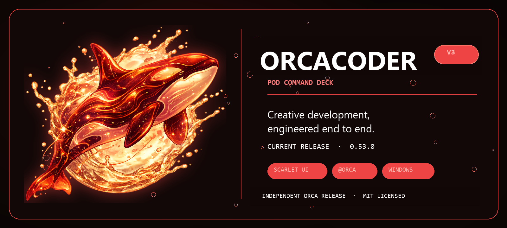

# OrcaCoder V3

<p align="center">
  
</p>

<p align="center">
  <strong>Creative development, engineered end to end.</strong>
</p>

OrcaCoder V3 is a self-contained, Windows-first AI creative-development workstation built
from the MIT-licensed [GG Framework](https://github.com/KenKaiii/gg-framework). It preserves
the upstream coding workflow while adding the Scarlet Orca identity, public **Orca / @Orca**
mentor, appearance controls, ocean-themed motion, and a base for OrcaVoice, media inspection,
ComfyUI, and Houdini workflows.

## Current status — 25 August 2026

| Area                 | Status                                                                                       |
| -------------------- | -------------------------------------------------------------------------------------------- |
| Repository           | [`24pfilms/orccoderv3`](https://github.com/24pfilms/orccoderv3) — private during development |
| Application version  | `0.53.0`, aligned with the imported GG Framework release                                     |
| Desktop runtime      | Tauri dev executable rebuilt and launched successfully on Windows                            |
| Branding             | OrcaCoder name, `com.orcacoder.desktop`, Scarlet native icons and favicon                    |
| Start page           | Scarlet two-panel deck, compact 1024×660 default window, responsive short-height layout      |
| Appearance           | Scarlet default plus nine persisted palettes; selector beside Autopilot/New                  |
| Attention theme      | Optional synchronized completion palette across all open OrcaCoder windows                   |
| Chat images          | Enlarged hover/focus preview with a slower 280ms fade-and-scale reveal                       |
| Mentor               | Public name and address are `Orca` / `@Orca`; internal `ken_*` protocol is retained          |
| Motion/copy          | Ocean-current empty state with 10 six-second rotating lines per mode                         |
| Board Mode           | Mero board ported behind a production-off flag; editing, video, and generation verified      |
| Updater              | Intentionally inert until Orca owns a release endpoint and signing key                       |
| Distribution         | Development build only; no Orca-signed public installer yet                                  |

**Today's result: Board Mode went from inert to usable.** Nineteen defects were found by driving
the real desktop app and reading the mutations that reached SQLite. Every one sat on a boundary
between two layers that were each correct in isolation — which is why the 74 Board tests passing
at the start of the day caught none of them. The focused Board suite now passes 24 files / 82
tests, `gg-app` TypeScript is clean, the Rust side builds, and creating, editing, styling, and
persisting board items is confirmed working in the running desktop app.

**Known local warning:** the optional `supademo` extension is missing
`~/.gg/extensions/supademo/plugin.json`. The warning does not block OrcaCoder startup.

## Board Mode

An infinite whiteboard ported from [Mero](https://github.com/24pfilms/Mero), running on a native
SQLite store with fenced single-editor leases, compare-and-swap revisions, content-addressed
assets, and backup/restore. It is **off by default** and gated twice.

### Turning it on

```bash
VITE_BOARD_MODE_ENABLED=true pnpm --dir gg-app tauri dev
```

The flag is read from `import.meta.env`, so it is baked in when Vite starts — setting it after
the dev server is running has no effect. A runtime kill switch also applies: Board Mode stays off
if `localStorage` holds `orcacoder.board-mode.disabled = "true"`. Both gates fail closed.

With the flag on, a **Board** control appears in the window header beside Workspace.

There is also a browser-only fixture that needs no flag, no Tauri, and no database — useful for
working on the canvas itself:

```bash
pnpm --dir gg-app dev
# then open http://localhost:1420/?boardFixture=mero-core
```

### What works

Sticky notes, text, shapes, arrows, frames, and pen drawing; images via the native picker;
selection, marquee, drag, resize, rotate, and double-click text editing; font size, colour, layer
order, duplicate, delete, and votes; a right-click menu including maximize/minimize/download for
images; undo and redo; zoom, fit, and minimap; PNG/JPG/PDF/CSV export. Everything persists through
the lease and revision layer, and a second window on the same board opens read-only with an
explicit takeover.

**Generate an image.** Right-click empty canvas → *Generate image…*, describe what you want, and
the result lands on the board. It uses the ChatGPT OAuth credential the app already holds — no
API key and no second sign-in — through the same Codex endpoint and `image_generation` tool the
`ggcoder` agent uses, so it costs ChatGPT subscription quota rather than API billing. The request
runs in Rust, not the webview, so the board itself still makes no outbound calls, and the returned
bytes pass through exactly the same validation as a file you pick by hand: magic-byte sniffing,
raster limits, the storage cap, and lease authorization.

**Embed a YouTube video.** Right-click empty canvas → *Add YouTube video…* and paste any YouTube
link. The player is inert until you double-click it, so board gestures (select, drag, resize)
always win — an iframe otherwise swallows pointer input and turns every resize into a drag. Videos
embed through `youtube-nocookie.com`, and the CSP is opened to those two player hosts and nothing
else. This is the one deliberate narrowing of the board's no-remote-content invariant.

### Not yet ported

Drag-and-drop of files onto the canvas, text scaling with resize, right-drag marquee, image crop,
clear-board, and centre-content. These are tracked in
[`tasks/board-parity-todo.md`](tasks/board-parity-todo.md).

Mero's remaining AI features — edit-with-AI on an existing image, image-to-video, and regenerate —
are **deferred**, not missing by accident. Mero drove them through Gemini, and this migration
excluded Gemini credentials by design. Text-to-image generation has since been rebuilt on the
OpenAI credential the app already owns (above); the others could follow the same route.

### A note on testing

Nineteen defects were fixed on 25 August 2026, and the Board suite was green before, during, and
after every one of them. The tests mock the repository, so each layer looked correct on its own
while disagreeing with its neighbour — a serde attribute that renamed enum variants but not their
fields, a payload allow-list that permitted `fontSize` on text but not on notes, a custom URI
scheme that WebView2 will not load, pointer capture that stole clicks from the toolbar, and
`overflow-x: auto` on a parent that clipped a menu out of existence. End-to-end coverage against
the real binary is the gap worth closing next.

## Self-contained Orca sources

No runtime or build step reads from OneDrive, the archived L-drive projects, or `.gg/uploads`.
Everything needed for the current Orca identity is stored under this repository:

- Theme engine and Scarlet skin: [`gg-app/src/orca/`](gg-app/src/orca/)
- Artwork and icon-generation sources: [`gg-app/src/assets/`](gg-app/src/assets/)
- Native application icons: [`gg-app/src-tauri/icons/`](gg-app/src-tauri/icons/)
- Theme maintenance guide: [`gg-app/THEMING.md`](gg-app/THEMING.md)
- Product and visual contracts: [`PRODUCT.md`](PRODUCT.md) and [`DESIGN.md`](DESIGN.md)
- Upstream provenance/sync policy: [`UPSTREAM.md`](UPSTREAM.md)
- MIT license and original notices: [`LICENSE`](LICENSE)

## Run the current Orca build

```bash
pnpm install --frozen-lockfile
pnpm --filter @kenkaiiii/ggcoder build
pnpm --dir gg-app bundle:sidecar
pnpm --dir gg-app tauri dev
```

The first packaged build also needs the committed/staged Node sidecar described in
[`gg-app/DISTRIBUTION.md`](gg-app/DISTRIBUTION.md). Internal `@kenkaiiii/*`, `ggcoder`,
`ken_*`, and legacy storage names intentionally remain for upstream and session compatibility.

---

# Upstream GG Framework feature guide

**This is the main thing.** A real desktop app, not a chat box with a code theme. Every
window is its own agent, pointed at its own project folder, running real tools on your
machine.

<p align="center">
  <a href="https://github.com/KenKaiii/gg-framework/releases/latest"></a>
  <a href="https://github.com/KenKaiii/gg-framework/releases/latest"></a>
</p>

Signed and notarized on macOS. It updates itself, so you install it once and forget about it.

## As many projects as you want, all going at once

Yeah, you can split a terminal into panes. That's where this workflow came from. The
difference is this is **actual software** now: real OS windows you can move between
desktops, tile with one click, full-screen individually, and pick up with your mouse.

Open GG Coder on your side project in one window, your client's Next.js app in another, a
Rust thing in a third, a landing page in a fourth. Each window runs its **own** agent, its
own folder, its own model, its own history. Nothing bleeds between them.

<p align="center">
  
</p>

Six projects, six different models (Claude, Codex, a local qwen3-coder, Gemini, Kimi, GLM),
all going at the same time. And six isn't the ceiling either. Tile 2, 4, 6, or hit
auto-arrange and it lays out however many you've got open.

### It stays light

The whole shell is **Rust**. No Electron, no bundled browser engine sitting in RAM per
window. It uses the renderer your OS already ships, and each window's agent only costs you
something while it's actually running. Six windows open is a normal Tuesday, not a fan
event.

<p align="center">
  
</p>

## Everything else it does

### It finds the projects you're already working on

Not just GG Coder ones. It digs up everything you've touched in **Claude Code and Codex**
too. Pick one, keep going.

<p align="center">
  
</p>

### You can actually see what it's doing

Chat stays readable. Tools stream in a pinned panel at the bottom, so you see every file
it touches and every command it runs without your conversation turning into a wall of
JSON. Git branch, uncommitted count, open issues and PRs up top. Context %, thinking
level and both models down bottom.

<p align="center">
  
</p>

### Use whatever model you want

Anthropic, OpenAI/Codex, Gemini, Kimi, GLM, MiniMax, DeepSeek, Xiaomi MiMo, xAI,
OpenRouter. OAuth or API key, your call. Kimi and Grok take both at once — your
subscription goes first and the API key covers you automatically when plan usage runs
out. Swap models mid-conversation, nobody's stopping you.

<p align="center">
  
</p>

### Including the ones running on your own machine

Ollama, LM Studio, llama.cpp and vLLM get found automatically on their normal ports. No
config, no flags. Real context windows and capabilities come from the server itself, so a
model that can't call tools gets flagged right here instead of blowing up on your first
prompt.

<p align="center">
  
</p>

### Autopilot, the one nobody knows about

Flip Autopilot on and Ken (a mentor agent) reviews every finished run. If the work's not
good enough he sends GG Coder straight back in with specific feedback, and it keeps going
until he signs off. You go make coffee.

<p align="center">
  
</p>

Real loop above: it built a rate limiter, Ken caught that the bucket was per-process and
sent it back, it moved the thing into Redis and added a test, Ken signed off. Nobody
typed anything in between.

### It can see

Drag in a screenshot. Paste a design. Throw a video at it. Video goes straight to the
models that handle it (Gemini 3.x, Kimi K3, MiniMax M3, MiMo-V2.5). For the ones that
don't, the agent gets the file and reaches for ffmpeg itself.

### Plan mode

Read-only poking around first, a written plan you approve, then it goes. For the stuff you
really don't want it improvising on.

### It catches its own type errors

Every edit gets checked by a real language server. TypeScript ships in the box, zero
setup, so type errors get caught and fixed in the same turn it created them. Python, Go,
Rust and C/C++ kick in if their toolchain is on your PATH.

### MCP, subagents, memory, the works

Paste any `claude mcp add …` line and it just works. Spawn subagents for parallel work.
Project memory, notes, chat export, prompt enhancement, your own slash commands in
`.gg/commands/*.md`.

### It watches your quota

Live usage meter in the title bar. How much of your 5-hour and weekly window you've
burned, and when it resets. No more surprise rate limits.

### And it's a bit stupid, on purpose

XP, ranks and streaks for shipping. Sound. ASCII banners. Webcam gaze focus if you want
your eyeballs to switch windows for you.

## Run it from source

```bash
git clone https://github.com/KenKaiii/gg-framework.git
cd gg-framework
pnpm install
pnpm --filter @kenkaiiii/ggcoder build   # build the sidecar first
cd gg-app && pnpm tauri dev
```

Packaging stuff (bundled Node runtime, single-file sidecar, code signing) is in
[gg-app/DISTRIBUTION.md](gg-app/DISTRIBUTION.md).

---

# ⌨️ The CLI

Same agent, in your terminal. The app is the face, this is the engine.

```bash
npm i -g @kenkaiiii/ggcoder
ggcoder
```

OAuth login so there's no API keys to paste, full terminal UI, tools, MCP, LSP
diagnostics, session resume. → [packages/ggcoder](packages/ggcoder/README.md)

---

# 🧱 The framework underneath

Every layer ships on its own. Take one, take all of them.

| Package                                                                    | What it does                                            | README                                           |
| -------------------------------------------------------------------------- | ------------------------------------------------------- | ------------------------------------------------ |
| [`@kenkaiiii/gg-ai`](https://www.npmjs.com/package/@kenkaiiii/gg-ai)       | One streaming API for every provider up there           | [packages/gg-ai](packages/gg-ai/README.md)       |
| [`@kenkaiiii/gg-agent`](https://www.npmjs.com/package/@kenkaiiii/gg-agent) | Agent loop with multi-turn tool execution               | [packages/gg-agent](packages/gg-agent/README.md) |
| [`@kenkaiiii/gg-core`](https://www.npmjs.com/package/@kenkaiiii/gg-core)   | Shared guts: model registry, OAuth, auth storage, paths | [packages/gg-core](packages/gg-core/README.md)   |
| [`@kenkaiiii/ggcoder`](https://www.npmjs.com/package/@kenkaiiii/ggcoder)   | The CLI, plus the sidecar the desktop app runs          | [packages/ggcoder](packages/ggcoder/README.md)   |
| [`@kenkaiiii/gg-boss`](https://www.npmjs.com/package/@kenkaiiii/gg-boss)   | Drives a bunch of workers across projects from one chat | [packages/gg-boss](packages/gg-boss/README.md)   |

```
@kenkaiiii/gg-ai (standalone)
  └─► @kenkaiiii/gg-agent
        └─► @kenkaiiii/gg-core
              ├─► @kenkaiiii/ggcoder ──► GG Coder desktop app ⭐
              └─► @kenkaiiii/gg-boss
```

The desktop app forks **zero** agent logic. Windows, IPC and UI live in `gg-app/`.
Everything else is the exact same spine the CLI runs.

## What do I actually need?

| You want to...                                           | Use                                                                               |
| -------------------------------------------------------- | --------------------------------------------------------------------------------- |
| Code with a real UI, across as many projects as you want | **[Download GG Coder](https://github.com/KenKaiii/gg-framework/releases/latest)** |
| Code in your terminal                                    | `npm i -g @kenkaiiii/ggcoder`                                                     |
| Run a bunch of agents across projects from one chat      | `npm i -g @kenkaiiii/gg-boss`                                                     |
| Build your own agent that calls tools and loops          | `npm i @kenkaiiii/gg-agent`                                                       |
| Stream from any LLM provider with one API                | `npm i @kenkaiiii/gg-ai`                                                          |

---

## For devs

```bash
pnpm install
pnpm build      # tsc across all packages
pnpm check      # typecheck
pnpm test       # vitest
```

TypeScript 5.9 · pnpm workspaces · Tauri 2 · React 19 · Vite 7 · Ink 6 · Vitest 4 · Zod v4

---

## Come hang out

- [YouTube @kenkaidoesai](https://youtube.com/@kenkaidoesai) for tutorials and demos
- [Skool community](https://skool.com/kenkai)

---

## License

MIT

---

<p align="center">
  <strong>Less bloat. More coding. Every model. Every project. One window each.<br>
  Rust under the hood, so it stays out of your way.</strong>
</p>

<p align="center">
  <a href="https://github.com/KenKaiii/gg-framework/releases/latest"></a>
  <a href="https://www.npmjs.com/package/@kenkaiiii/ggcoder"></a>
</p>
