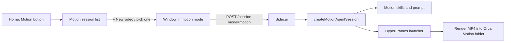

# Orca Motion

**Make videos by describing them.** Orca Motion is OrcaCoder's third workspace, alongside
Code (Pod Dock) and Chat (Chat Pod). You give it an idea, a website, a PDF or a folder of
screenshots; it plans the video with you, builds it as an animated HTML composition, renders it
to MP4, checks its own frames, and takes edits in plain English ("at the 19-second mark, line
the highlights up with the music").

It first shipped in **OrcaCoder 0.58.0**. It is a port of the Motion workspace from upstream
[GG Framework](https://github.com/KenKaiii/gg-framework), rebranded and wired into OrcaCoder's
Scarlet home screen, with switches that remove it cleanly.

> First real job: a 45-second product-launch video for OrcaFilm, built from real app
> screenshots and brand art, then revised over several rounds (shot timing, hover
> roll-overs, highlight alignment, background colour) — in the dev build, then again in the
> installed 0.58.0.

---

## Using it

1. **Home screen → Mission Controls → Motion** (clapperboard icon).
2. The Motion list shows your past video sessions. Pick one to keep editing it, or choose
   **+ New video**.
3. Start from a **starter card** (_Make a product launch_, _Make an explainer_, _Make a
   social ad_, _Make animated titles_) or type your own brief. You can paste a link, name a
   folder of images, or drop a PDF.
4. Motion proposes a plan first — format, look, beats, sources — and asks what it needs
   (name, music, output folder). Nothing renders until you agree.
5. It builds, renders, checks its own frames, and tells you where the MP4 is. Ask for
   changes in the same session; it keeps the project and edits in place.

**Where things live**

| What                            | Where                                                            |
| ------------------------------- | ---------------------------------------------------------------- |
| Video projects and renders      | `<your projects folder>\Orca Motion\` (created on first use)     |
| Motion session history          | `~/.gg/motion-sessions/` — separate from coding and chat history |
| The Motion bundle in an install | `%LOCALAPPDATA%\orcacoder\sidecar\motion\`                       |

The `Orca Motion` folder is skipped by the Pod Dock project list, so it never shows up as a
code project.

**Tips from the first session**

- Point it at real material (app screenshots, brand art). It designs around what it's given.
- Say what's wrong with a moment in time ("between 19 and 25 seconds the cuts are too
  slow"). It re-times and re-renders just that stretch.
- Tell it what to leave out. It skipped a competitor's screenshots on its own, and an
  unrelated image once you named it.

---

## What's inside

| Part                   | What it gives Motion                                                                                                                                                                                      |
| ---------------------- | --------------------------------------------------------------------------------------------------------------------------------------------------------------------------------------------------------- |
| **Motion agent**       | Its own system prompt and a fixed tool set: files, shell, web search/fetch, screenshots, image generation, `ask_user`, and `motion_check`. No MCP servers, no project skills, no plan mode, no Autopilot. |
| **HyperFrames 0.8.82** | The video engine, bundled and pinned. Compositions are HTML + GSAP (or Lottie, Three.js, CSS), rendered frame-accurate to MP4. The launcher never downloads another version and opts out of telemetry.    |
| **4 private skills**   | `motion` (plan → bind → build → check → deliver), `brand-kit` (fonts, colours, logos), `source-ingest` (sites, PDFs, images, footage, repos), `video-qa` (one checking pass). Invisible to Code and Chat. |
| **Style library**      | 11 render-verified looks (Swiss Grid, Dark Studio, Editorial Ink, Terminal Phosphor, Blueprint, …) and 50 reusable pieces.                                                                                |
| **Offline media**      | 21 SIL OFL fonts, a music and sound-effects library, and a synth that scores a beat-locked music bed.                                                                                                     |
| **Helper tools**       | Contact sheets, frame review, PDF extraction, font install, Three.js install, "reveal in Explorer", and `motion_check` for technical checks on a render.                                                  |

**Licences.** HyperFrames is Apache-2.0; code is MIT; fonts are SIL OFL 1.1; music by Sascha
Ende is CC BY 4.0 (credit is voluntary here; the one rule is never register it with Content
ID); sound effects are CC0. Full list: `packages/ggcoder/assets/motion/THIRD-PARTY.md`.

---

## How it fits together



- **App (`gg-app`)**: the `motion` workspace mode and entry view, the Motion session picker,
  starter cards, Motion wake-screen lines, composer placeholder and footer. Motion windows get
  the lighter Chat-style header: no Autopilot, Notes, Tasks or Brain.
- **Desktop backend (Rust)**: `WorkspaceMode::Motion`, so a Motion window reopens as Motion on
  relaunch.
- **Engine (`ggcoder`)**: the sidecar accepts `mode: "motion"`; `AgentSession` gained the
  options Motion needs (`agentRole: "primary"`, a fixed `skills` list, `contextLimits`);
  `findMotionBundle()` locates and validates the bundle, or Motion reports itself unavailable.
- **Packaging**: the sidecar bundler copies the Motion bundle and the `hyperframes` package
  only when `VITE_MOTION_ENABLED=true`. Native packages now follow npm's `os`/`cpu` rule, so
  only Windows binaries ship; that kept the installer at **105 MB** instead of 254 MB.

**Cost of adding it:** the 0.57.6 installer was 75 MB, 0.58.0 is 105 MB, so Motion adds about 30 MB.

---

## Turning it off

| Level            | How                                                                           | Rebuild? |
| ---------------- | ----------------------------------------------------------------------------- | -------- |
| Hide it          | Settings → **Motion on/off**. Hides the button in every open window at once.  | No       |
| Build without it | Leave out `VITE_MOTION_ENABLED=true`: no button, no bundle, no `hyperframes`. | Yes      |
| Remove it        | `git revert` the Motion commits; every shared line is tagged `[motion]`.      | Yes      |

Step-by-step instructions are in [motion-removal.md](motion-removal.md).

**Building with Motion (what 0.58.0 used):**

```bash
pnpm -r build
VITE_MOTION_ENABLED=true pnpm --filter gg-app prebundle
cd gg-app && VITE_BOARD_MODE_ENABLED=true VITE_MOTION_ENABLED=true pnpm tauri build
```

For dev, add `VITE_MOTION_ENABLED=true` in front of `pnpm tauri dev`.

---

## Not ported (on purpose)

- **Upstream's completion-review hook.** Motion itself leaves it unset upstream.
- **Upstream's UI overhaul** (tooltips, dithered home, Phosphor icons). OrcaCoder keeps its
  Scarlet design; Motion uses the same lucide icons as the rest of the app.
- **"GG" branding.** Every visible string, the agent's name, and the workspace folder say
  Orca Motion / OrcaCoder.

## Verification

- All ten test suites pass: 5,450+ tests, including Motion's own ~150 engine tests, a
  launcher test that runs the bundled HyperFrames, and 4 tests for the on/off switch. The Rust
  suite gains `workspace_restores_motion_mode`.
- Dev build: full video session, several rounds of edits.
- Installed 0.58.0: Motion button present, new video starts and renders.

## Bugs fixed on the way

- **Motion sessions opened as Chat.** The session picker still passed a hard-coded `"chat"`,
  so the first test ran with no shell and no video skills ("My shell won't start here"). It now
  passes its own mode.
- **Installer ballooned to 254 MB.** A forced reinstall put every platform's esbuild and sharp
  binaries on disk, and the bundler shipped them all. It now keeps only the build machine's.
- **Missing `tslib`.** HyperFrames' CLI needs it through `@swc/helpers`; it is now a pinned
  direct dependency (the same fix upstream made).
