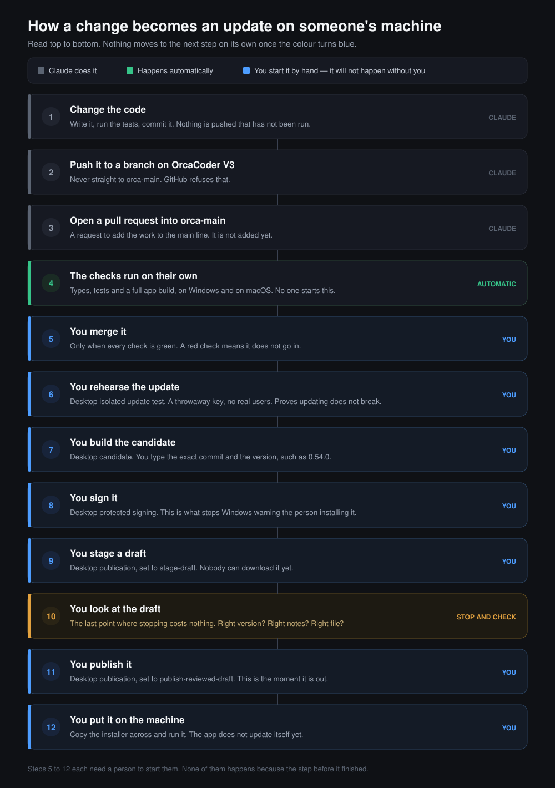
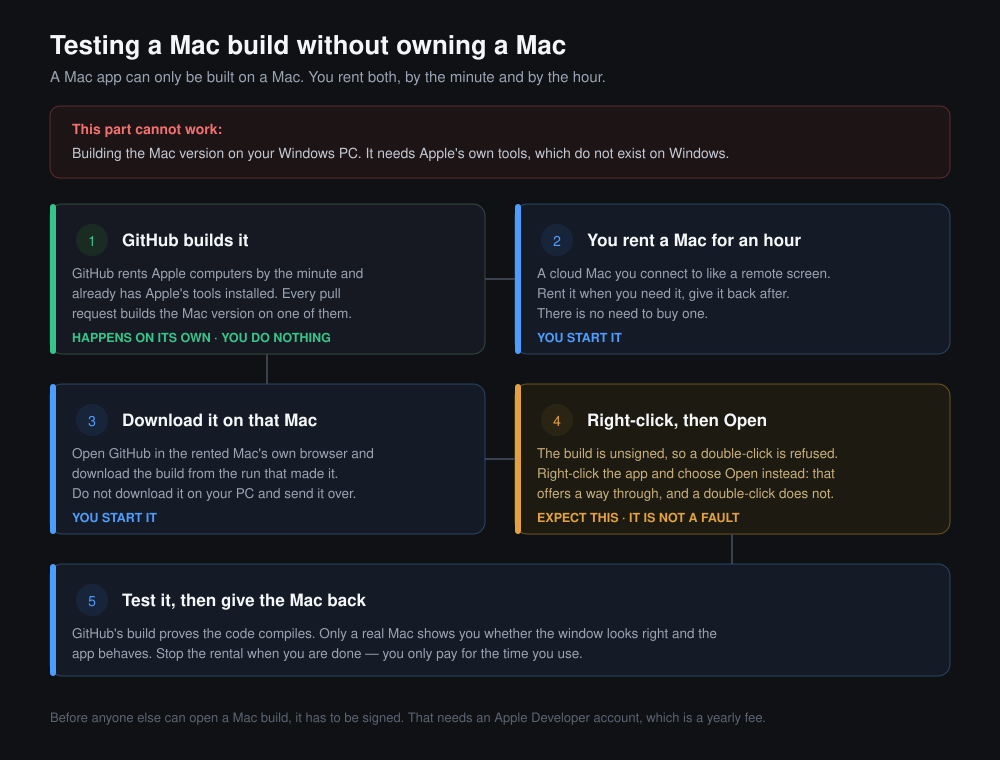

# Shipping an update to OrcaCoder

**Written:** 26 August 2026
**For:** anyone who needs to push work, cut a version, or put a new build on a machine.

This explains where the code lives, how a change becomes an installer, and which
decisions a person has to make along the way. Read section 3 before your first
release.

---

## 1. The whole process in one picture

<p align="center">
  
</p>

There is also a **web version** of this in
[`shipping-orcacoder.html`](shipping-orcacoder.html), beside this file. Open it in
a browser. It adds the exact workflow names to click in the Actions tab, what
four common failures mean, and plain definitions for the terms in here.

Read the picture top to bottom. The colour tells you who acts:

- **Grey** — Claude does it.
- **Green** — happens on its own once a pull request is open.
- **Blue** — you start it by hand. It will not happen without you.
- **Amber (step 10)** — stop and look. The last point where stopping costs
  nothing.

Nothing ships by itself. Every step that produces something a person could
install has to be started deliberately, with the exact version and commit typed
in. That is on purpose: a mistake needs someone to make it, not just a script to
run.

Your part is to decide **what** ships and **when**. The automated part is to
build it the same way every time, and to refuse when a check fails.

The rest of this document explains each step, and what to do when one of them
goes wrong.

---

## 2. Where the code lives

| Nickname   | Repository                | What it is                           | Push to it?     |
| ---------- | ------------------------- | ------------------------------------ | --------------- |
| `origin`   | `24pfilms/orccoderv3`     | **OrcaCoder V3. The product's home.** | Yes, via a branch |
| `mero`     | `24pfilms/OrcaCoder_Mero` | Only where the board came from        | No              |
| `upstream` | `KenKaiii/gg-framework`   | The MIT project this was built from   | Never           |

`mero` was used once, to take the whiteboard code and bring it into OrcaCoder. It
is not where work goes. `upstream` belongs to someone else.

### The main branch is `orca-main`, and it is protected

You cannot push to `orca-main`. GitHub refuses it. Work gets there through a
pull request that passes the required checks.

So the routine is:

```bash
# 1. Push your branch (any name; this one already exists)
git push origin HEAD:test/updater-pipeline

# 2. Open a pull request into orca-main
gh pr create --base orca-main --head test/updater-pipeline
```

Checks run automatically. When they pass, the pull request can merge. No
reviewer approval is required — the checks are the gate.

### Check before you push

```bash
git fetch origin && git log --oneline origin/orca-main..HEAD
```

That lists exactly the commits you are about to send.

---

## 3. Fix this before the first release

**Right now no pull request into `orca-main` can merge.** The branch protection
asks for six checks. CI only produces two.

| Protection requires           | CI runs                    |
| ----------------------------- | -------------------------- |
| `windows-2025 · node 24.15.0` | Yes                        |
| `app · windows-2025`          | Yes                        |
| `macos-15 · node 24.15.0`     | Yes, added 26 August 2026   |
| `app · macos-15`              | Yes, added 26 August 2026   |
| `ubuntu-24.04 · node 24.15.0` | **No**                     |
| `app · ubuntu-24.04`          | **No**                     |

macOS was added to the matrix on 26 August 2026, so four of the six now exist.
The two Ubuntu checks still do not, and a required check that never starts waits
forever. **A pull request still cannot merge.**

Two ways to finish it. Pick one:

- **Match the rules to reality.** In the repository settings, require the four
  checks that exist and drop the two Ubuntu ones. Correct while nobody runs
  OrcaCoder on Linux.
- **Add Ubuntu to CI.** Only worth it if Linux is genuinely going to be
  supported. Otherwise it is a job that has to pass without protecting anyone.

The first is a settings change on GitHub, so someone with admin rights has to
make it. Until one of the two is done, work can be pushed to a branch but cannot
reach `orca-main`.

### Why macOS is in CI when there is no Mac

It builds; it does not ship. The macOS job compiles the app and runs the
cross-platform checks, then stops. It does not sign, notarize, or produce
anything installable, and nobody is given a macOS build.

The point is early warning. If a change breaks the macOS build, that shows up on
the pull request that caused it instead of months later when Mac support is
actually wanted — when the cause is buried under hundreds of other commits.

A macOS app cannot be built on Windows. It needs the macOS SDK and Xcode's
tools, and there is no practical cross-compile. GitHub's `macos-15` runners are
what make this possible without owning a Mac. Note that macOS runner minutes on
a private repository bill at a much higher rate than Linux, so keep the macOS
job to pull requests rather than every push.

### Testing a Mac build without owning a Mac

<p align="center">
  
</p>

The obvious order does not work, because step one has to happen on a Mac. The
order that does work:

1. **GitHub builds it.** Every pull request builds the macOS app and keeps it for
   seven days, under the artifact name `orcacoder-macos-unsigned`. You do nothing.
2. **You rent a Mac for an hour.** A cloud Mac is a real Apple computer you
   connect to like a remote screen. MacinCloud and Scaleway suit short sessions.
   Avoid Amazon's Mac service for this — it bills a minimum of twenty-four hours
   per machine.
3. **Download it on that Mac**, using its own browser. Do not download it on the
   PC and send it over: it is a longer trip for the same file, and moving a `.app`
   between machines can damage it. (This is also why CI zips the bundle before
   uploading — a `.app` is a directory, and uploading it unzipped flattens it into
   loose files that will not launch.)
4. **Right-click the app and choose Open.** The build is unsigned, so a plain
   double-click is refused. Right-click offers a way through; double-click does
   not. Expected, and not a fault.
5. **Test it, then stop the rental.** CI proves the code compiles. Only a real
   screen shows you whether the window looks right.

Two things are still missing before a Mac build could be given to anyone:

- **An Apple Developer account** for signing and notarization. Unsigned apps on
  current macOS can report themselves as damaged and refuse to open, which is
  worse than the Windows warning. `entitlements.plist` is already written for
  this, including the JIT permissions the bundled Node sidecar needs to avoid
  crashing at launch on a notarized build.
- **A real Mac for testing.** CI proves it compiles. It cannot tell you the
  window looks right. Renting a cloud Mac by the hour is enough for that; there
  is no need to buy one.

---

## 4. What an update is made of

Four things have to line up. Getting one wrong produces a build that looks fine
and is wrong.

**1. The version number.** Four files hold it and they must match. One command
updates all four:

```bash
cd gg-app && node scripts/bump-version.mjs 0.54.0
```

Use `patch`, `minor`, `major`, or type the exact version. Do this **before**
building, so the installer's filename carries the right number.

**2. The artwork.** The installer shows two images: a sidebar and a header. They
are built from PNGs into the exact BMP format NSIS demands:

```bash
cd gg-app && pnpm installer:art
```

Only needed when the artwork changes. If you want new art for a release, replace
the source PNGs in `gg-app/installer/`, run that command, and commit the result
in `installer/out/`. It has to be committed, because the build reads the
committed files, not your local ones.

**3. The sidecar.** The background program that does the real work. It is
compiled separately and then bundled into the app:

```bash
cd packages/ggcoder && pnpm build     # compile the sidecar's source
cd gg-app && pnpm prebundle           # bundle it into the app
```

**`pnpm prebundle` is not run by the build.** Skip it and the installer quietly
ships the sidecar from last time, while reporting success.

**4. The installer itself.**

```bash
cd gg-app && VITE_BOARD_MODE_ENABLED=true pnpm tauri build
```

`VITE_BOARD_MODE_ENABLED=true` switches Board Mode on. It is fixed at build
time and cannot be changed afterwards. Leave it out and the finished app has no
Board Mode.

---

## 5. The release pipeline

There are five workflows in `.github/workflows/`. Only the first runs on its
own. Every other one has to be started by a person from the Actions tab, and
asks for exact values — a 40-character commit, a version, the ID of the previous
step's run. Typing those by hand is the point: it is hard to release the wrong
thing by accident.

| Order | Workflow                    | Starts how           | What it does                                     |
| ----- | --------------------------- | -------------------- | ------------------------------------------------ |
| 1     | `ci.yml` — CI               | Automatic on PR      | Types, tests, size and startup gates, app build   |
| 2     | `desktop-test-update.yml`   | You start it         | Rehearses the update using a throwaway key        |
| 3     | `release.yml` — Candidate   | You start it         | Builds the real installer from one exact commit   |
| 4     | `desktop-sign.yml`          | You start it         | Signs that candidate with the protected key       |
| 5     | `desktop-publish.yml`       | You start it, twice  | Stages a draft, then publishes it after review    |

Step 5 runs twice on purpose: `stage-draft` first, then
`publish-reviewed-draft`. Its own description says to review the draft before
publishing. That gap is where a person looks at what is about to go out.

### About the automatic updater

It is switched off. In `gg-app/src-tauri/tauri.conf.json`:

```json
"updater": { "pubkey": "", "endpoints": [] }
"createUpdaterArtifacts": false
```

No endpoint means nothing to check. No public key means no way to prove a
download is genuine. So today, an update reaches a machine because a person
copies the installer there and runs it. The signing and publishing workflows
exist for the day that changes, but the app itself does not yet look for
updates.

---

## 6. Testing: what to do so nothing breaks

Yes, test — and test the *update*, not just the build. A fresh install working
proves very little about installing over an existing copy.

**Runs on its own, on every pull request:**

- Typecheck, framework package tests, ggcoder tests
- Size and startup gates
- A full app build on Windows

**You have to start these deliberately:**

- **`desktop-test-update.yml`** — the important one. It builds an NSIS package,
  signs it with a **throwaway test key**, and assembles an isolated test release.
  It rehearses the update path without touching the real signing key or any real
  user. Run this before any release that changes how the app installs or starts.
- **`pnpm smoke:packaged`** (Windows) — builds an MSI, extracts it, and launches
  the packaged app with a throwaway user profile to prove the shell and the
  bundled sidecar start together with a visible window. It exists because the
  ordinary tests run the sidecar directly and cannot catch the failures real
  users hit after installing: a missing `ggnode.exe`, a sidecar left out of the
  installer, a console window flashing, or no window at all.

**Only a person can check these:**

- Install over the previous version on a machine that has it, and confirm
  settings and logins survive.
- Open the app and use the parts you changed.
- Check that the version shown in the app matches the one you meant to ship.

### Always confirm the build actually happened

A build can report success and produce nothing. This has happened here.

```bash
ls -l gg-app/src-tauri/target/release/bundle/nsis/
```

If the timestamp is not from the last few minutes, it did not run. Do not trust
the exit code by itself.

---

## 7. Who decides what

| Decision                                   | Who     |
| ------------------------------------------ | ------- |
| Whether to release at all                  | **You** |
| Which version number, and why               | **You** |
| Whether the artwork changes                 | **You** |
| Which exact commit ships                    | **You** |
| Whether the staged draft looks right        | **You** |
| Publishing to real users                    | **You** |
| Running the tests and reporting what failed | Me      |
| Bumping the four version files together     | Me      |
| Rebuilding the artwork into BMP             | Me      |
| Building the installer in the right order   | Me      |
| Checking output exists and is new           | Me      |
| Writing down what shipped                   | Me      |

The pattern: I do the work and report what is true. You decide what goes out.
Nothing reaches a user without you starting a workflow by hand.

---

## 8. A worked example

You say: *"New build, 0.54.0, with the new installer artwork."*

Then:

1. **I confirm the starting point.** Which commit, everything committed, tests
   passing. If anything is unverified, I say so before we start.
2. **You supply the artwork**, or approve what is there. I run
   `pnpm installer:art`, commit the output, and show you the result.
3. **I bump the version** to `0.54.0` across all four files and commit it.
4. **I open a pull request** into `orca-main`. CI runs. I report what passes and
   what fails, without smoothing it over.
5. **You decide to merge** once it is green.
6. **You start `desktop-test-update`** and we check the update path works.
7. **You start `release.yml`** with the exact commit and `0.54.0`.
8. **You start `desktop-sign.yml`** with that run's ID.
9. **You start `desktop-publish.yml`** as `stage-draft`. You review the draft.
10. **You start it again** as `publish-reviewed-draft`. That is the moment it
    ships.
11. **I write down** what shipped, which commit, and what was tested.

Steps 5 through 10 are all yours. I can prepare each one and tell you exactly
what to type, but I do not start them.

---

## 9. Quick reference

| Task                       | Command                                                      |
| -------------------------- | ------------------------------------------------------------ |
| See what you would push    | `git log --oneline origin/orca-main..HEAD`                    |
| Push your branch           | `git push origin HEAD:test/updater-pipeline`                  |
| Open a pull request        | `gh pr create --base orca-main`                               |
| Run the tests              | `cd gg-app && pnpm test`                                      |
| Set the version            | `cd gg-app && node scripts/bump-version.mjs 0.54.0`           |
| Rebuild installer artwork  | `cd gg-app && pnpm installer:art`                             |
| Compile the sidecar source | `cd packages/ggcoder && pnpm build`                           |
| Bundle the sidecar         | `cd gg-app && pnpm prebundle`                                 |
| Build the installer        | `cd gg-app && VITE_BOARD_MODE_ENABLED=true pnpm tauri build`  |
| Packaged smoke test        | `cd gg-app && pnpm smoke:packaged`                            |

---

## 10. Installing on another machine

1. Copy the `.exe` from `gg-app/src-tauri/target/release/bundle/nsis/`.
2. Run it. Windows shows a blue warning because the local build is unsigned.
   Click **More info**, then **Run anyway**. Installers from the signing
   workflow do not show this.
3. Settings and logins live in `C:\Users\<you>\.gg\` — not in the installer.
   That folder survives installing, updating, and uninstalling, which is why a
   new install on a machine you have used already knows who you are.

**Never copy the `.gg` folder to another machine or into a shared file.** It
holds `auth.json` and `api-keys.json` — your logins. The installer itself
contains no credentials and is safe to give to other people.

---

## 11. Mistakes to avoid

1. **Pushing to `mero` or `upstream`.** `mero` was only the board's source.
   `upstream` belongs to someone else.
2. **Expecting `git push` on its own to work.** Name the remote and branch.
3. **Skipping `pnpm prebundle`.** Your sidecar change will not be in the
   installer, and the build will still say it succeeded.
4. **Leaving out `VITE_BOARD_MODE_ENABLED=true`.** The app ships without Board
   Mode and it cannot be switched on afterwards.
5. **Building before bumping the version.** The installer's filename will carry
   the old number.
6. **Believing a build worked because it said so.** Check the timestamp.
7. **Publishing a draft without opening it.** The two-step exists so someone
   looks.
8. **Testing only a fresh install.** Most update failures only appear when
   installing over an existing copy.
